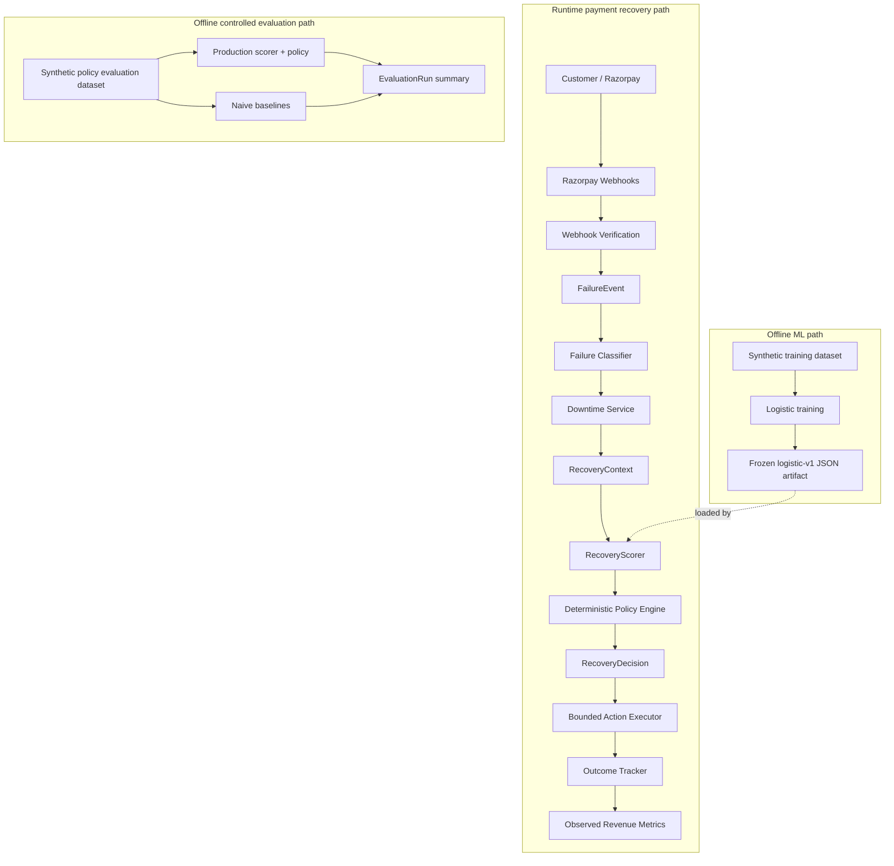

# RecoveryIQ Architecture

## System paths



The solid runtime path handles real verified payment evidence. The offline ML path creates the frozen scorer artifact. The offline evaluation path compares decision strategies and never mutates RecoveryCases, Razorpay, notifications, or action execution.

## Mission

RecoveryIQ is a context-aware revenue recovery system for failed recurring Razorpay subscription payments. It will help merchants diagnose failures, choose safe interventions, and measure recovered revenue with an audit trail.

## Pipeline overview

Razorpay → Webhook → Failure Normalizer → Failure Classifier → Context Builder → Recovery Scorer → Policy Engine → Action Executor → Outcome Tracker

Stages 1 through 6 implement the pipeline through deterministic decision persistence. The Action Executor and Outcome Tracker shown in the long-term pipeline remain future work.

## Ownership boundary

Razorpay controls native subscription charging, automatic retry timing, and subscription state. RecoveryIQ controls only merchant-side intervention decisions around those events.

The future intervention choices are `WAIT_NATIVE_RETRY`, `SEND_NUDGE`, `REQUEST_CARD_UPDATE`, and `STOP_AND_ESCALATE`.

Rules determine which actions are allowed. ML estimates recovery probability. The deterministic Policy Engine is authoritative. An LLM may only write customer communication and must never select a financial recovery action.

## Stage 1 components

- Next.js client shell
- Express API with liveness and database readiness endpoints
- MongoDB/Mongoose persistence foundation
- Shared recovery domain contracts and merchant policy configuration
- Six primary collection schemas
- Synthetic CloudDesk subscription seed data

## Stage 2 components

- Idempotent, tagged CloudDesk plan setup in Razorpay Test Mode
- Backend-owned subscription creation
- Razorpay Standard Checkout authorization UI
- Timing-safe server-side authorization signature verification
- Authoritative Razorpay subscription fetch and local synchronization

Stage 2 does not process webhooks or payment failures. Manual synchronization is temporary until Stage 3.

## Stage 3 components

- Raw-body Razorpay webhook signature verification
- Event ID deduplication and processing-state persistence
- Explicit subscription pending, halted, charged, activated, and cancelled handlers
- Minimal raw failure evidence normalized as `UNKNOWN`
- Observational RecoveryCase opening, recovery, and cancellation lifecycle
- Audit records and stale-event transition guards

Webhook ordering is not assumed. An authoritative Razorpay `created_at` older than a subscription's last processed webhook timestamp is ignored. Cancelled and completed subscription states do not regress, and active does not regress to created or authenticated. Recovery is recorded only from `subscription.charged`, never from activation alone.

Stage 3 does not classify failures, score recovery, select actions, send notifications, or influence Razorpay retries.

## Stage 4 components

FailureEvent → deterministic FailureClassifier → Razorpay Downtime Service → RecoveryContext Builder → RecoveryCase `DIAGNOSED`

- `classifier-v1` uses exact reason mappings first, conservative mandate patterns second, then source and narrowly supported step fallbacks.
- Raw Razorpay error evidence remains unchanged on FailureEvent.
- `UNKNOWN` is a valid diagnosis when Razorpay evidence is sparse or unfamiliar.
- Downtime matching distinguishes confirmed broad method downtime from method-only correlation where instrument applicability cannot be proven.
- Downtime lookup failure is represented as unknown and never blocks diagnosis.
- RecoveryContext computes subscription age, native retry availability, unique failure count, customer history, case age, diagnosis, and downtime context.

Stage 4 does not score, select, or execute any recovery action. Razorpay continues to own charging and native retry scheduling.

## Stage 4.5 components

`payment.failed` → normalized payment evidence → authoritative invoice lookup → tracked subscription correlation → FailureEvent → existing Stage 4 diagnosis refresh

- Raw-body signature verification and `x-razorpay-event-id` deduplication remain unchanged.
- Invoice `subscription_id` is the only accepted cross-resource correlation key. Customer, amount, plan, and timestamp heuristics are prohibited.
- Payment IDs are unique evidence keys, so webhook retries and distinct events for the same attempt cannot double-count failures.
- A correlated payment refreshes the existing open case. It never creates a second case for that subscription.
- If payment evidence arrives before a pending lifecycle event, it is preserved and attached when that event opens the case.
- Card, VPA, token, bank-account, and full webhook/payment payloads are not persisted.

Stage 4.5 still makes no recovery decision and does not influence Razorpay retry behavior.

## Stage 5 components

Failure Diagnosis → RecoveryContext → RecoveryScorer → candidate probability estimates

- `heuristic-v1` scores all four candidate actions independently.
- Base probabilities and additive context adjustments are versioned, deterministic engineering assumptions.
- Every score includes its calculation explanation and integer expected recovered minor units.
- Scores are advisory and may include actions a future Policy Engine will prohibit.
- A case remains `DIAGNOSED`; scoring creates neither decisions nor actions.
- Re-scoring replaces `latestScores` and refreshes one `RECOVERY_SCORED` audit entry.

`heuristic-v1` is not machine learning and its values are not claimed as observed Razorpay recovery statistics.

## Stage 5B components

```text
RecoveryContext -> RecoveryScorer
                   |- heuristic-v1
                   `- logistic-v1
```

- `heuristic-v1` remains the transparent engineering baseline.
- `logistic-v1` predicts seven-day synthetic recovery probability for each candidate action.
- Training is offline on `synthetic-recovery-v1`; Node loads portable JSON and never runs Python.
- Explicit context/action interactions capture that intervention effectiveness depends on failure context.
- Python parity fixtures must match Node inference within `1e-6`.
- `RECOVERY_SCORER` selects the implementation; logistic artifact failure never silently falls back.
- The case remains `DIAGNOSED`, and both scorers produce estimates only.

RecoveryIQ separates prediction from decision-making. Logistic Regression estimates the probability of recovery for each candidate intervention. A later deterministic Policy Engine decides which actions are actually allowed. This prevents the ML model from directly controlling financial workflows.

All Stage 5B data, metrics, and probabilities are synthetic simulation results. They are not merchant performance, causal lift, or recovered-revenue claims.

## Stage 6 components

The implemented decision pipeline is:

```text
Failure Detection
  -> Diagnosis
  -> RecoveryContext
  -> RecoveryScorer
  -> Deterministic Policy Engine
  -> RecoveryDecision
```

Stage 6 stops at `RecoveryDecision`; execution is not completed functionality. `policy-v1` is a pure deterministic function with no MongoDB, Razorpay, network, LLM, or randomness dependency. It evaluates terminal status, RecoveryIQ case-age policy, invalid mandates and payment methods, confirmed downtime, halted native retry state, nudge limits/cooldowns, and unknown-failure safeguards in fixed precedence. These merchant-policy limits are not Razorpay restrictions.

Only when no hard rule selects one action does the persisted `heuristic-v1` or `logistic-v1` score rank the actions policy permits. Context and score timestamps reject stale predictions. An identical repeated decision returns the current decision and keeps a single audit event. A new diagnosis clears prior scores and decision, requiring Score and Decide again. `latestDecision` stays on RecoveryCase, preserving the six-collection architecture, and no action record is created.

Why not choose the highest ML probability directly? Success probability does not establish operational or ethical appropriateness. A nudge can be prohibited by the contact limit, WAIT is invalid for a halted Razorpay subscription, and card update is unnecessary during temporary provider downtime. ML ranks possibilities. Policy constrains them. ML estimates recovery probability. Deterministic policy controls financial workflow decisions.

## Stage 7 components

```text
Prediction -> Policy -> Execution -> future Outcome Measurement
```

`RecoveryExecutionService` requires a current persisted decision, atomically reserves one embedded action per deterministic decision identity, and dispatches to a focused executor. It invokes neither the scorer nor Policy Engine. Repeat requests return the existing action; failures remain explicit and never select a fallback.

- WAIT records an executed no-op with `retryOwner=razorpay` and `customRetryScheduled=false`. It performs zero Razorpay payment API calls.
- NUDGE uses deterministic template content through a notification interface. The configured provider is simulation-only and records `customerContacted=false`, so contact counters remain unchanged.
- CARD UPDATE creates a customer-driven, 60-minute session using a cryptographically random token while persisting only its SHA-256 hash. Checkout uses the server-owned subscription ID and card-change flag. Timing-safe HMAC verification authenticates the callback.
- STOP records merchant review escalation and transitions the case to `STOPPED`; it integrates with no ticketing or payment system.

Verified browser card-change completion transitions the action and case to `ACTION_EXECUTED`, never `RECOVERED`. Authoritative `subscription.charged` webhook handling remains responsible for recovery state; Stage 8 now records that observed outcome conservatively.

## Stage 8 components

```text
Failure -> Diagnosis -> Prediction -> Policy -> Execution -> Outcome -> Revenue Measurement
```

`RecoveryOutcomeService` accepts only safe normalized captured-payment evidence from the existing verified and deduplicated `subscription.charged` pipeline. It correlates by attached failure invoice first (`EXACT_INVOICE/HIGH`), then by one unique open subscription case within seven days (`SUBSCRIPTION_ONLY/MEDIUM`). It does not guess among multiple cases or use customer, amount, plan, or timestamp alone. Closed STOPPED/EXHAUSTED cases require exact invoice evidence.

The embedded outcome caps observed revenue at original case risk, records remaining risk, finalizes one payment once, calculates non-negative time-to-recovery and the seven-day observation target, and preserves the executed action. `RecoveryMetricsService` aggregates cases directly from MongoDB into observed risk, recovery, unresolved revenue, rates, timing, and descriptive “recovered after action” breakdowns.

Observed Recovery is authoritative payment success. Action Association is a conservative description of event order and evidence strength. Causal Uplift is a controlled-comparison claim that RecoveryIQ does not yet make. An action is not successful merely because it was selected or executed; only authoritative Razorpay payment evidence records recovered revenue. Temporal association is kept separate from causal uplift so the ML system receives no credit it cannot prove.

## Stage 9 controlled synthetic policy evaluation

```text
Fresh synthetic-policy-eval-v1 contexts + hidden evaluation truth
  -> production LogisticRecoveryScorer or heuristic-v1
  -> production policy-v1
  -> selected action
  -> evaluation-only ground-truth lookup
  -> expected and shared-draw realized metrics
```

The generator uses seed 4242 and the published Stage 5B synthetic-world assumptions, but creates 10,000 fresh context-level episodes rather than training context/action rows. Hidden probabilities, random draws, and simulated outcomes never enter `RecoveryContext`, a scorer, or the Policy Engine. `train.py` reads only `synthetic_recovery_v1.csv`; the evaluation artifact is prohibited as training input and `logistic-v1` remains frozen.

RecoveryIQ Logistic + Policy and Heuristic + Policy share the exact deterministic `policy-v1`. Retry First and Nudge First are transparent feasible baselines; Nudge First respects the merchant contact limit and cooldown. One common random value per context is shared across strategies. STOP_AND_ESCALATE's synthetic probability represents later external/manual resolution, not payment collection by STOP itself.

The offline command writes JSON and Markdown reports. It does not touch RecoveryCases, Razorpay, notifications, or action execution. Persistence is explicit with `--persist` and upserts one summary in the existing `evaluationRuns` collection. `/api/v1/evaluation/latest` reads that summary and never evaluates 10,000 contexts during a request.

All Stage 9 revenue and uplift values are synthetic, simulated controlled-evaluation results. They do not prove production merchant uplift. The real Razorpay integration validates operational data flow; Stage 9 evaluates policy behavior under published assumptions.
